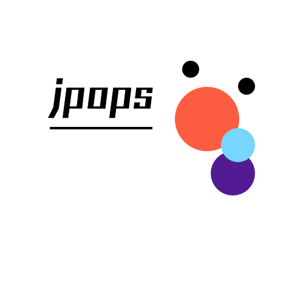

<!-- README.md is generated from README.Rmd. Please edit that file -->

```{r, include = FALSE}
knitr::opts_chunk$set(
  collapse = TRUE,
  comment = "#>",
  fig.path = "man/figures/README-",
  out.width = "100%"
)
```

# jpops 

(Sorry, English version of README is not availavle for now.)

<!-- badges: start -->
[](https://CRAN.R-project.org/package=jpops)
[](https://lifecycle.r-lib.org/articles/stages.html#experimental)
<!-- badges: end -->

jpopsは日本国内で行われた人口に関する統計調査のデータを提供するRパッケージです。

データの取得はe-StatのAPIを経由して行います。APIを利用するためのapplication idは各自で取得してください。

## Installation

パッケージは現在CRANには登録されていません。次のコマンドを実行してインストールをしてください。

``` r
if (!requireNamespace("remotes"))
   install.packages("remotes")
remotes::install_github("uribo/jpops")
```

## Example

```{r example}
library(jpops)
```

### 国勢調査

### 人口等基本集計 (2020~2000)

男女別総数

```{r, eval=FALSE, echo=TRUE}
Sys.setenv("ESTAT_TOKEN") <- "{取得したapplication id}"

get_jinkou(2020, appid = Sys.getenv("ESTAT_TOKEN"))

# 2回目以降のデータ取得はキャッシュを利用して高速化できます。
# この時appid引数の入力は必須ではありません
get_jinkou(2020, cache = TRUE)

# キャッシュを利用せずAPI経由でデータを再取得するには cache = FALSE を指定します
get_jinkou(2020, appid = Sys.getenv("ESTAT_TOKEN"), cache = FALSE)
```


男女・年齢別

```{r, eval=FALSE, echo=TRUE}
get_jinkou_age(2020, appid = Sys.getenv("ESTAT_TOKEN"))
```

